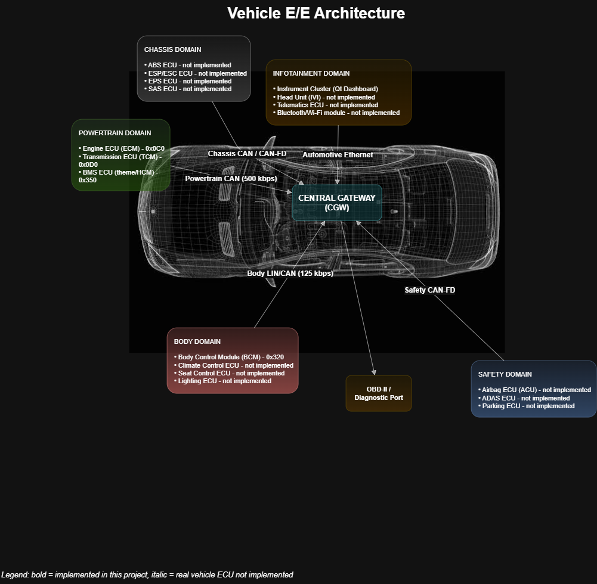

# Automotive ECU Project — EV Multi-ECU CAN Network with Live Dashboard and UDS Diagnostics

A simulated electric vehicle: five ECU processes exchange live CAN frames on a Linux `vcan0` bus, a Qt dashboard
shows every signal (with a live Check Engine Light), and a UDS/ISO-TP diagnostic stack reads signals, DTCs and
freeze frames.

**Technologies / keywords:** C++17, Qt (Widgets, QPainter, QThread `moveToThread`), Linux SocketCAN, `vcan0`,
CAN 2.0, UDS ISO 14229-1, ISO-TP ISO 15765-2, DTC / freeze frame, Python `python-can`, CMake.



## Team and roles
| Member | Role | Owns |
| :--- | :--- | :--- |
| Member 1 — laraamr1030-oss | Architecture & Powertrain Lead | Architecture diagram, network design, Engine/Transmission/BMS ECUs |
| Member 2 — YoussiAhmedEissa | Diagnostics Dev | UDS handler, Python tester, FaultManager / DTC / freeze frame |
| Member 3 — lojine | Dashboard & Integration Dev | Qt dashboard, CAN worker thread, integration, build, docs |

## Architecture at a glance
| Process | CAN IDs it sends | Notes |
| :--- | :--- | :--- |
| `engine_ecu` | 0x0C0, 0x0C1, 0x7E8 | engine simulation, fault monitoring, UDS server |
| `transmission_ecu` | 0x0D0 | speed + gear derived from engine RPM |
| `bcm` | 0x320 | doors, hazard, turn signals |
| `bms_ecu` (theme ECU) | 0x350 | SoC, pack temperature, pack voltage, charging |
| `dashboard` | 0x7E0 (Clear-DTC button only) | listens to everything |

Docs: [network design + bus load](docs/network_design.md) · [signal dictionary](docs/signal_dictionary.md)

## Build
Requirements: Linux, `g++` (C++17), `cmake` ≥ 3.16, `can-utils`, Qt5 or Qt6 (Widgets + Svg + Network), Python 3.10+ with `python-can`.
```bash
sudo apt install build-essential cmake can-utils qtbase5-dev libqt5svg5-dev python3-pip
pip install python-can
cmake -S . -B build && cmake --build build -j
```
(For Qt6 install `qt6-base-dev libqt6svg6-dev` instead.) Binaries land in `build/bin/`.

## Run
```bash
./run_demo.sh                       # creates vcan0, starts 4 ECUs + dashboard
candump vcan0                       # in another terminal: all IDs live at once
python3 uds_tester.py               # UDS tester: all DIDs, DTCs, freeze frame, clear, reset
./capture_evidence.sh               # saves docs/evidence/candump_all_ids.log
```
The engine and BMS run a scripted 60 s cycle that triggers, in order: P0A7E (t≈18 s), P0300, P0117, P0AFA, P0563.
Each DTC goes pending (0x05) → confirmed (0x8D, Check Engine Light on) → persists (0x88) until cleared.

Offline self-test (no vcan needed):
`g++ -std=c++17 -Isrc/powertrain/engine_ecu tests/test_diagnostics_offline.cpp src/powertrain/engine_ecu/uds_handler.cpp -o build/test_diag -pthread && ./build/test_diag`

## Signature feature (Phase 7): diagnostics from the dashboard itself
The dashboard shows the ECU's live diagnostic state (stored DTC count and named active faults decoded from 0x0C1)
and has a **Clear DTCs** button that sends a real UDS `0x14` request from the dashboard's CAN worker socket and
shows the ECU's positive/negative response. We chose it because it closes the diagnostic loop inside the
vehicle UI (a technician no longer needs the Python tester to reset the lamp) and it exercises the whole
chain — Qt UI → worker thread → CAN → ISO-TP/UDS handler → FaultManager → 0x0C1 → CEL turning off.

## Demo evidence
- `docs/evidence/candump_all_ids.log` — all IDs on the bus at once
- `docs/evidence/uds_transcript.txt` — full tester run
- `docs/evidence/dashboard_cel_on.png` / `dashboard_cel_cleared.png` — dashboard reacting to a fault and to the clear
